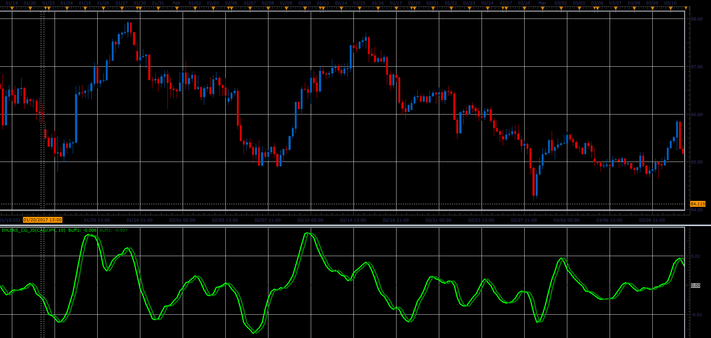

# Ehlers Center of Gravity

> Source: https://fxcodebase.com/code/viewtopic.php?f=48&t=64783  
> Forum: 48 · Topic 64783 · 1 post(s)

---

## Ehlers Center of Gravity

**Alexander.Gettinger** · Mon Jun 12, 2017 10:48 am

The COG oscillator is a John Ehler's FIR filer applied on the price. Center of Gravity actually has a zero lag and allows to define turning points precisely. This indicator is the result of Ehler's study of adaptive filters. The indicator Center of Gravity allows to identify main pivot points almost without any lag as well.

 

Download:

 [Ehlers_CG_JS.jsl](files/112853/Ehlers_CG_JS.jsl)
