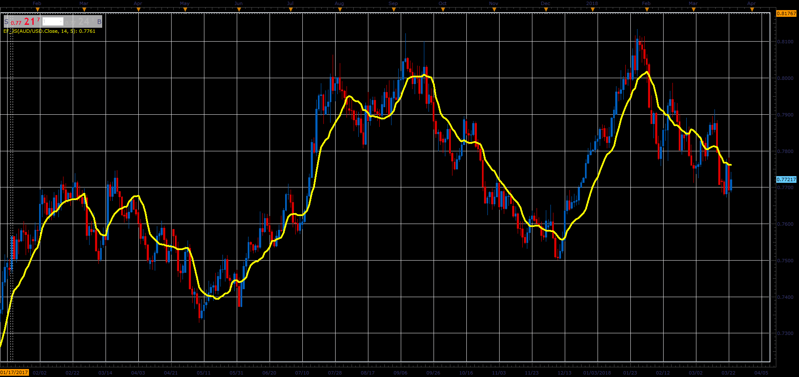
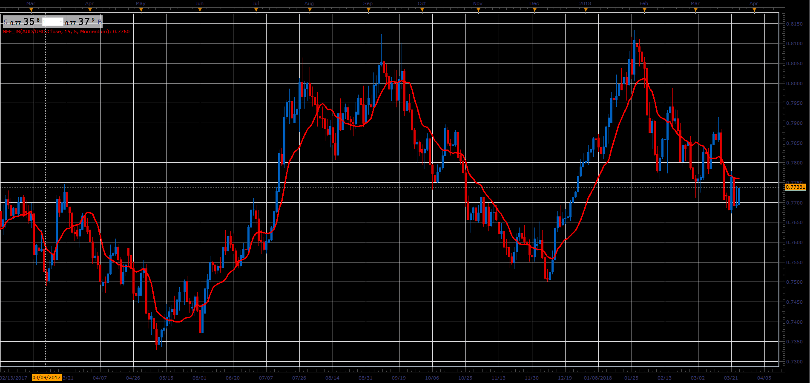

# Ehlers Filter

> Source: https://fxcodebase.com/code/viewtopic.php?f=48&t=65993  
> Forum: 48 · Topic 65993 · 1 post(s)

---

## Ehlers Filter

**Alexander.Gettinger** · Tue May 01, 2018 11:07 am

Formulas:
EF = MVA(PriceCoeff)/MVA(Coeff), where
PriceCoeff[i] = Coeff[i]*Price[i],
Coeff[i] = Abs(Price[i]-Price[i-Momentum]),
Abs - absolute value,
MVA - simple moving average with [Length] number of periods.

 

Download:

 [EF_JS.jsl](files/118919/EF_JS.jsl)

**NEF:**

 

Download:

 [NEF_JS.jsl](files/118919/NEF_JS.jsl)
