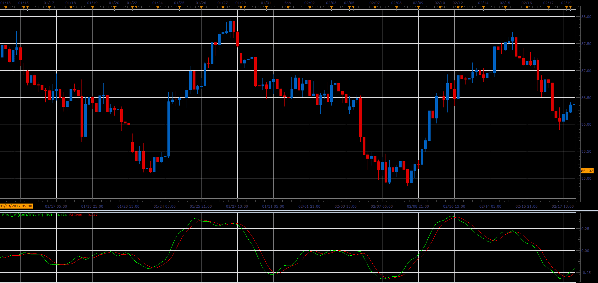

# Ehlers RVI oscillator

> Source: https://fxcodebase.com/code/viewtopic.php?f=48&t=64787  
> Forum: 48 · Topic 64787 · 1 post(s)

---

## Ehlers RVI oscillator

**Alexander.Gettinger** · Mon Jun 12, 2017 10:56 am

Formulas:
Value1 = ((Close - Open) + 2*(Close[1] - Open[1]) + 2*(Close[2] - Open[2]) + (Close[3] - Open[3]))/6;
Value2 = ((High - Low) + 2*(High[1] - Low[1]) + 2*(High[2] - Low[2]) + (High[3] - Low[3]))/6;
Num = Sum(Value1, Frame);
Denom = Sum(Value2, Frame);
RVI = Num / Denom;
RVISig = (RVI + 2*RVI[1] + 2*RVI[2] + RVI[3])/6;

 

Download:

 [ERVI_JS.jsl](files/112857/ERVI_JS.jsl)
