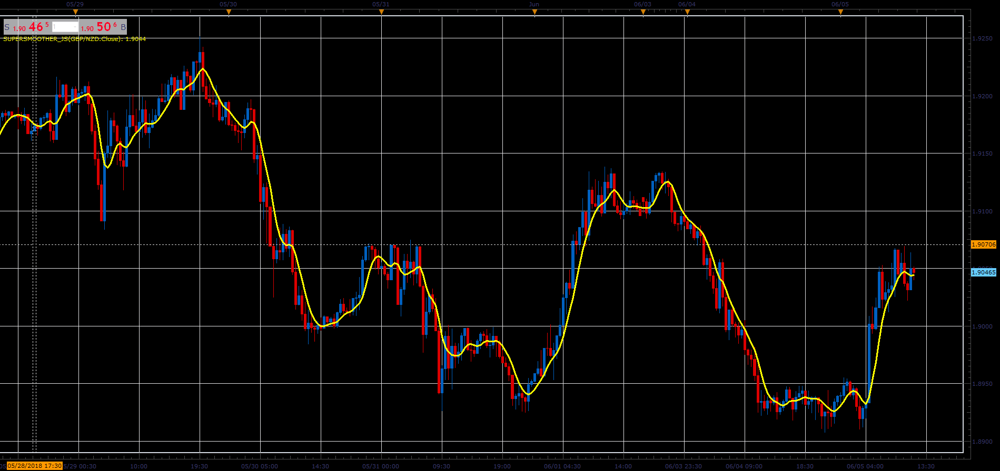

# Ehlers SuperSmoother

> Source: https://fxcodebase.com/code/viewtopic.php?f=48&t=66451  
> Forum: 48 · Topic 66451 · 1 post(s)

---

## Ehlers SuperSmoother

**Alexander.Gettinger** · Mon Aug 06, 2018 2:22 pm

Formula:
SS[i] = c1*(Price[i]+Price[i-1])/2+c2*SS[i-1]+c3*SS[i-2], where
c1, c2, c3 - constant coefficients.

 

Download:

 [SuperSmoother_JS.jsl](files/120383/SuperSmoother_JS.jsl)
