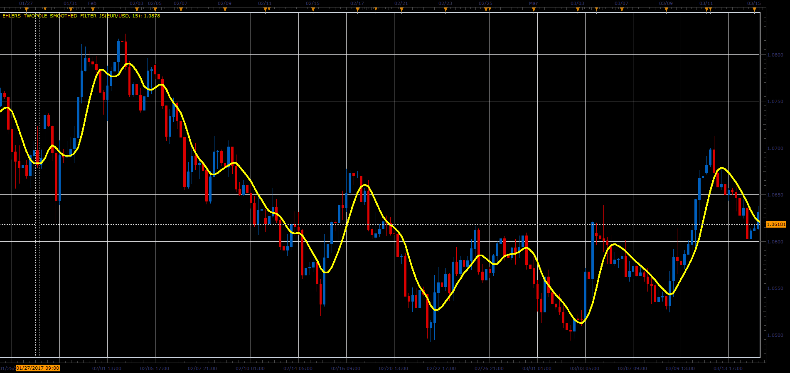

# Ehlers TwoPole smoothes filter

> Source: https://fxcodebase.com/code/viewtopic.php?f=48&t=64714  
> Forum: 48 · Topic 64714 · 1 post(s)

---

## Ehlers TwoPole smoothes filter

**Alexander.Gettinger** · Fri Jun 02, 2017 1:51 pm

Original researches by John F. Ehlers, described in "Cybernetic Analysis for Stocks and Futures" (2004) ISBN: 0-471-46307-8

Formula:
Filter[i] = Coeff1*Price[i]+Coeff2*Price[i-1]+Coeff3*Price[i-2], where
Coeff1 = 1-Coeff2-Coeff3,
Coeff2 = b1,
Coeff3 = -a1*b1,
a1 = Exp(-Sqrt(2)*Pi/Period),
b1 = 2*a1*Cos(Pi*Sqrt(2)/Period).

 

Download:

 [Ehlers_TwoPole_Smoothed_Filter_JS.jsl](files/112703/Ehlers_TwoPole_Smoothed_Filter_JS.jsl)
