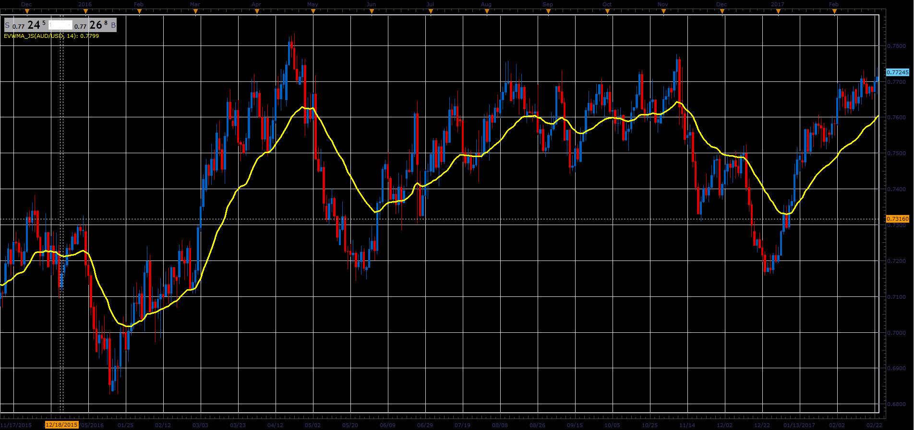

# Elastic Volume Weighted Moving Average

> Source: https://fxcodebase.com/code/viewtopic.php?f=48&t=65996  
> Forum: 48 · Topic 65996 · 1 post(s)

---

## Elastic Volume Weighted Moving Average

**Alexander.Gettinger** · Tue May 01, 2018 11:11 am

Total =Sum(volume, Period);

EVWMA = ((Total-volume)*EVWMA[-1]+ volume[period]*close)/Total;

 

Download:

 [EVWMA_JS.jsl](files/118922/EVWMA_JS.jsl)
