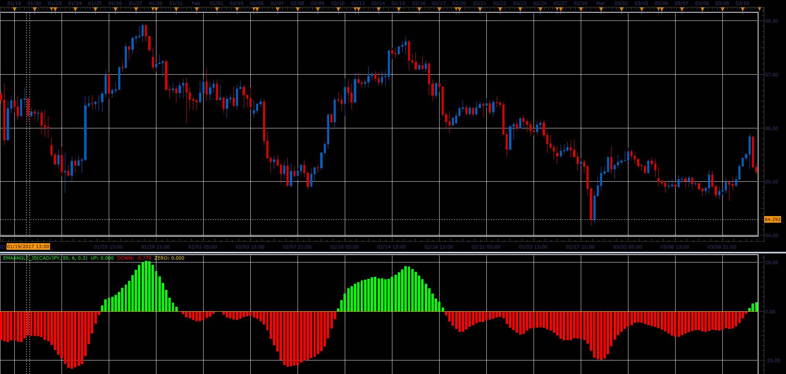

# EMA Angle

> Source: https://fxcodebase.com/code/viewtopic.php?f=48&t=64784  
> Forum: 48 · Topic 64784 · 1 post(s)

---

## EMA Angle

**Alexander.Gettinger** · Mon Jun 12, 2017 10:50 am

The indicator determines MA Angle (in Pips).

 

Download:

 [EmaAngle_JS.jsl](files/112854/EmaAngle_JS.jsl)
