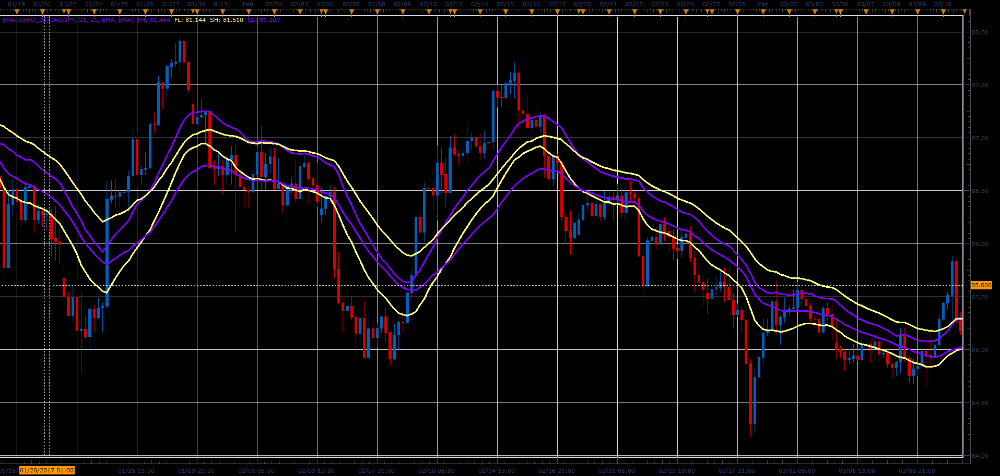

# EMA Trend Indicator

> Source: https://fxcodebase.com/code/viewtopic.php?f=48&t=64785  
> Forum: 48 · Topic 64785 · 1 post(s)

---

## EMA Trend Indicator

**Alexander.Gettinger** · Mon Jun 12, 2017 10:52 am

It is just fast and slow EMAs applied on high and low prices.

 

Download:

 [EMATrend_JS.jsl](files/112855/EMATrend_JS.jsl)
