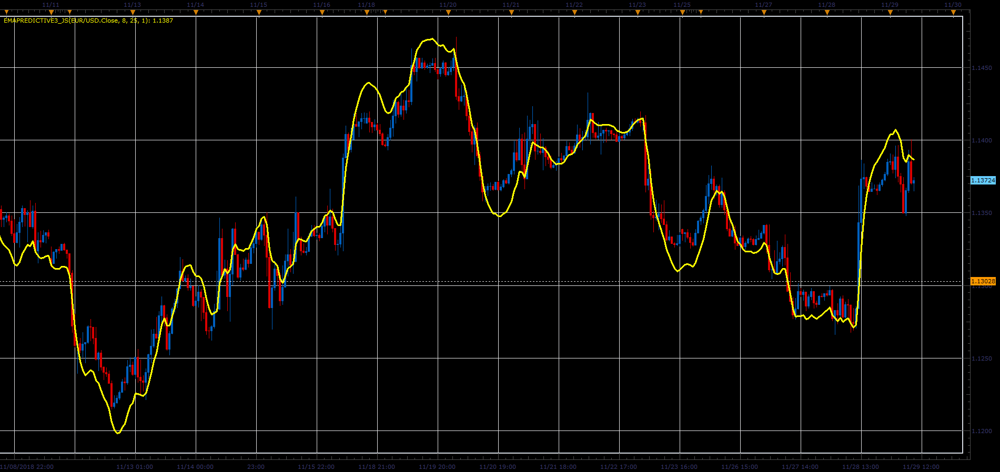

# EMAPredictive3 indicator

> Source: https://fxcodebase.com/code/viewtopic.php?f=48&t=67084  
> Forum: 48 · Topic 67084 · 1 post(s)

---

## EMAPredictive3 indicator

**Alexander.Gettinger** · Fri Dec 07, 2018 1:54 pm

Formulas:
EMAPredictive3=EMA(Short)+slope*t, where
slope=(EMA(Short)-EMA(Long))/(t1-t3),
t1=(LongPeriod-1)/2,
t3=(ShortPeriod-1)/2,
t=ShortPeriod+ExtraTimeForward.

 

Download:

 [EMAPredictive3_JS.jsl](files/122593/EMAPredictive3_JS.jsl)
