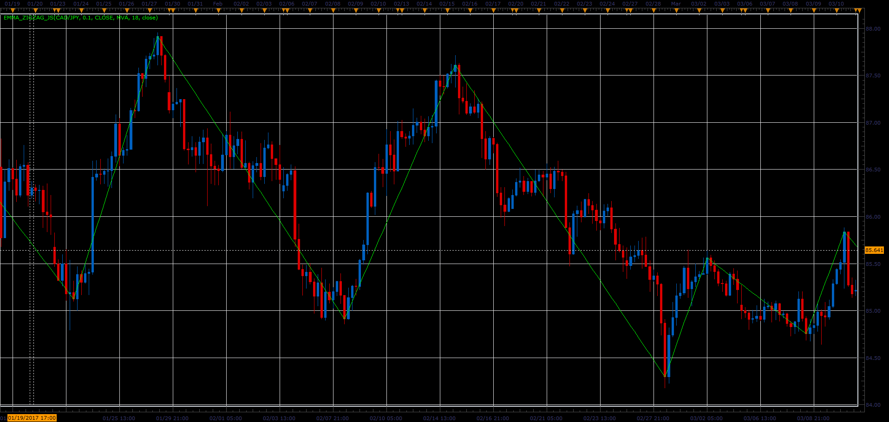

# EMMA ZigZag

> Source: https://fxcodebase.com/code/viewtopic.php?f=48&t=64786  
> Forum: 48 · Topic 64786 · 1 post(s)

---

## EMMA ZigZag

**Alexander.Gettinger** · Mon Jun 12, 2017 10:53 am

EMMA - Extremums Market Moving Average.
This indicator is an alternative ZigZag.
EMMA use deviation moving average for finding extremums.

 

Download:

 [EMMA_ZigZag_JS.jsl](files/112856/EMMA_ZigZag_JS.jsl)
