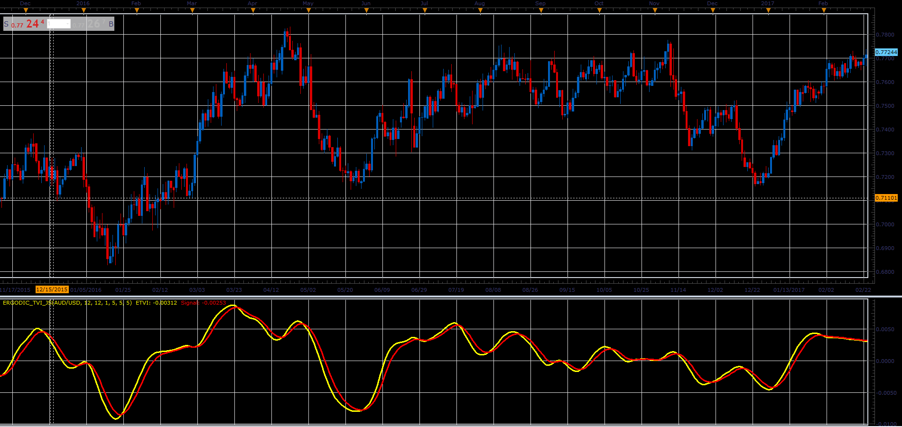

# Ergodic Tick volume indicator

> Source: https://fxcodebase.com/code/viewtopic.php?f=48&t=65995  
> Forum: 48 · Topic 65995 · 8 post(s)

---

## Ergodic Tick volume indicator

**Alexander.Gettinger** · Tue May 01, 2018 11:10 am

Formulas:
ETVI = EMA(EMA(TVI)),
Signal = EMA(ETVI), where
TVI = EMA(TV), where
TV = 100*(EMA_Up2-EMA_Dn2)/sum,
EMA_Up2 = EMA(EMA(UpTicks)),
EMA_Dn2 = EMA(EMA(DnTicks)),
UpTicks = (Volume+(Close-Open)/pipSize)/2,
DnTicks = Volume-UpTicks,
pipSize - size of 1 pip.

 

Download:

 [Ergodic_TVI_JS.jsl](files/118921/Ergodic_TVI_JS.jsl)

---

## Re: Ergodic Tick volume indicator

**logicgate** · Thu Dec 13, 2018 5:42 pm

Hi brother, can you please compile the MT4 version of this indi?

God Bless and good trades.

---

## Re: Ergodic Tick volume indicator

**logicgate** · Thu Dec 13, 2018 5:48 pm

Just to be sure, this is the Ergodic TVI Oscillator, correct? As in this image:

---

## Re: Ergodic Tick volume indicator

**Apprentice** · Fri Dec 14, 2018 1:54 pm

In indicator we use
UpTicks[period]=(source.volume[period]+(source.close[period]-source.open[period])/pipSize)/2;
DnTicks[period]=source.volume[period]-UpTicks[period];

In the article, Up / Down volume is provided by Broker.

---

## Re: Ergodic Tick volume indicator

**logicgate** · Fri Dec 14, 2018 1:57 pm

> **Apprentice wrote:**
> In indicator we use
> UpTicks[period]=(source.volume[period]+(source.close[period]-source.open[period])/pipSize)/2;
> DnTicks[period]=source.volume[period]-UpTicks[period];
>
> In the article, Up / Down volume is provided by Broker.

I think that if you use the same principle fo that cumulative delta indicator I posted, it might work.

---

## Re: Ergodic Tick volume indicator

**logicgate** · Fri Dec 14, 2018 2:02 pm

You way is correct, is just the example of the book the data source is different, but is the same idea. So It is just the matter of compiling the MT4 version, then! Cheers!

---

## Re: Ergodic Tick volume indicator

**Apprentice** · Mon Dec 17, 2018 6:22 am

Your request is added to the development list under Id Number 4375

---

## Re: Ergodic Tick volume indicator

**Apprentice** · Wed Dec 26, 2018 5:55 am

Try this version.
[viewtopic.php?f=38&t=67206](https://fxcodebase.com/code/viewtopic.php?f=38&t=67206)
