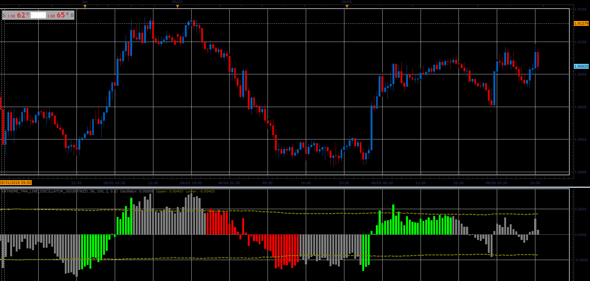

# Extreme TMA Line Oscillator

> Source: https://fxcodebase.com/code/viewtopic.php?f=48&t=66540  
> Forum: 48 · Topic 66540 · 1 post(s)

---

## Extreme TMA Line Oscillator

**Alexander.Gettinger** · Sat Aug 18, 2018 9:13 pm

Based on Extreme TMA Line indicator.
[viewtopic.php?f=17&t=59406](https://fxcodebase.com/code/viewtopic.php?f=17&t=59406)
Is calculated as difference between the closing price and Extreme TMA Line Indicator Central line.

Download:

 [Extreme_TMA_Line_Oscillator_JS.jsl](files/120643/Extreme_TMA_Line_Oscillator_JS.jsl)
