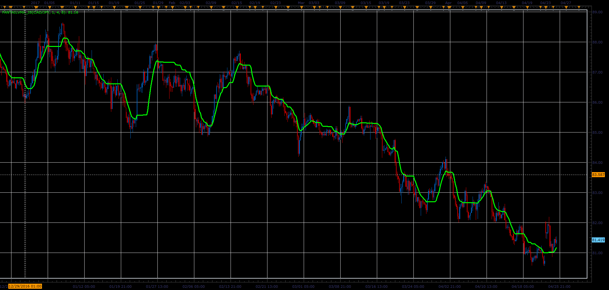

# FantailVMA indicator

> Source: https://fxcodebase.com/code/viewtopic.php?f=48&t=64792  
> Forum: 48 · Topic 64792 · 3 post(s)

---

## FantailVMA indicator

**Alexander.Gettinger** · Wed Jun 14, 2017 10:54 am

Download:

 [FantailVMA_JS.jsl](files/112885/FantailVMA_JS.jsl)

---

## Re: FantailVMA indicator

**xristos1982** · Wed Aug 24, 2022 1:19 pm

Can i have this in Lua,please?Thank you

---

## Re: FantailVMA indicator

**Apprentice** · Fri Aug 26, 2022 4:11 am

Lua version.
[https://fxcodebase.com/code/viewtopic.php?f=17&t=6489](https://fxcodebase.com/code/viewtopic.php?f=17&t=6489)

Both Lua and Jsl work on FXCM TS2
