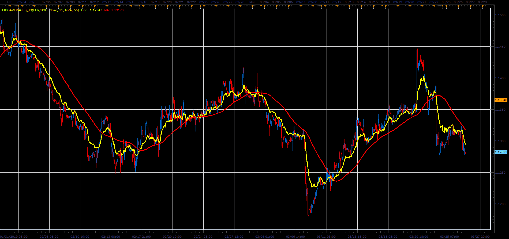

# Fibo averages indicator

> Source: https://fxcodebase.com/code/viewtopic.php?f=48&t=68218  
> Forum: 48 · Topic 68218 · 1 post(s)

---

## Fibo averages indicator

**Alexander.Gettinger** · Sat Mar 30, 2019 11:49 am

Formulas:
Fibo is a average of [FiboCount] prices with fibo shift. For example, if [FiboCount]=8 Fibo[i]=(Price[i]+Price[i-1]+Price[i-1]+Price[i-2]+Price[i-3]+Price[i-5]+Price[i-8]+Price[i-13])/8.
MA is a average of Fibo.

 

Download:

 [FiboAverages_JS.jsl](files/125437/FiboAverages_JS.jsl)

For this indicator must be installed AVERAGES indicator ([viewtopic.php?f=17&t=2430](https://fxcodebase.com/code/viewtopic.php?f=17&t=2430)).
