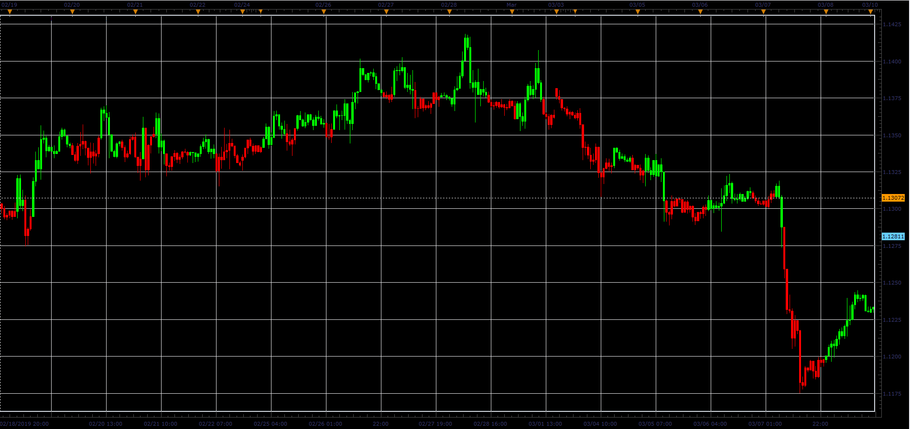
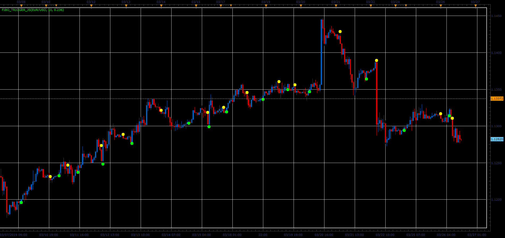

# Fibo trigger and candles indicators

> Source: https://fxcodebase.com/code/viewtopic.php?f=48&t=68217  
> Forum: 48 · Topic 68217 · 1 post(s)

---

## Fibo trigger and candles indicators

**Alexander.Gettinger** · Sat Mar 30, 2019 11:47 am

The indicator changes color when the conditions:
UP condition: Range*FiboLevel>=Close-MinLow,
DN condition: Range*FiboLevel>=MaxHigh-Close, where
Range=MaxHigh-MinLow,
MaxHigh and MinLow are a maximum and minimum prices at range from (i-Period) to (i).

 

 

Download:

 [Fibo_Candles_JS.jsl](files/125436/Fibo_Candles_JS.jsl)

 [Fibo_Trigger_JS.jsl](files/125436/Fibo_Trigger_JS.jsl)
