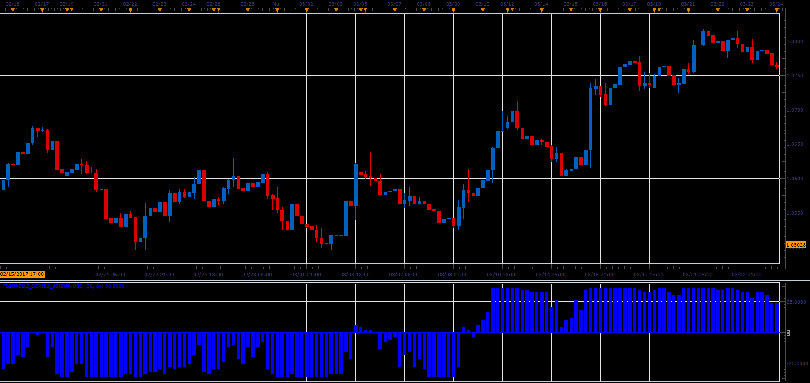

# Figurelli Series indicator

> Source: https://fxcodebase.com/code/viewtopic.php?f=48&t=64719  
> Forum: 48 · Topic 64719 · 1 post(s)

---

## Figurelli Series indicator

**Alexander.Gettinger** · Fri Jun 02, 2017 1:59 pm

The indicator calculates multiple moving averages trend, looking for divergence, start of reversal and strong trends.
Default configuration: 36 moving averages series trends compared each other. If indicator value is 36 or -36 indicates a strong rise/fall trend.

 

Download:

 [Figurelli_Series_JS.jsl](files/112708/Figurelli_Series_JS.jsl)
