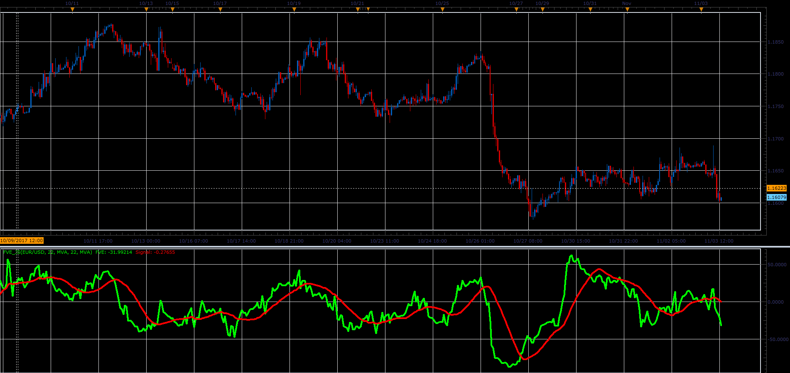

# Finite Volume Elements

> Source: https://fxcodebase.com/code/viewtopic.php?f=48&t=65543  
> Forum: 48 · Topic 65543 · 1 post(s)

---

## Finite Volume Elements

**Alexander.Gettinger** · Sat Jan 06, 2018 1:35 pm

Finite Volume Element Indicator (FVE) is a money flow indicator.
It was developed by Markos Katsanos and introduced in the April 2003 issue of Technical Analysis of Stocks & Commodities magazine.
It was modified in the September 2003 issue of TASC.

Values above zero are bullish and indicate accumulation,
while values below zero indicate distribution.
Divergences between price and the indicator can be leading signals to possible change in trend.

 

Download:

 [FVE_JS.jsl](files/116822/FVE_JS.jsl)
