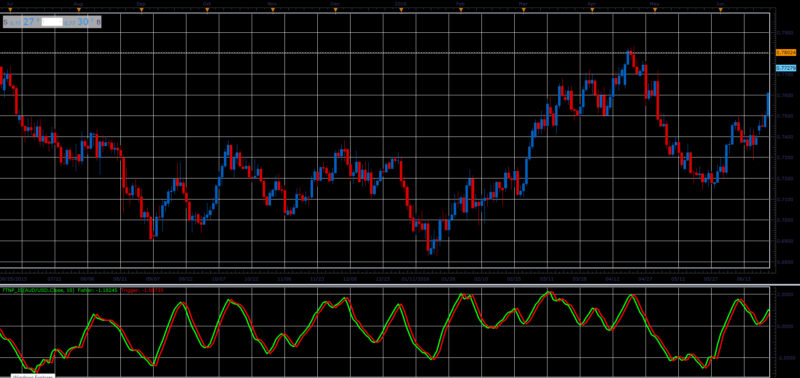

# Fisher Transform of Normalized Prices

> Source: https://fxcodebase.com/code/viewtopic.php?f=48&t=66004  
> Forum: 48 · Topic 66004 · 3 post(s)

---

## Fisher Transform of Normalized Prices

**Alexander.Gettinger** · Tue May 01, 2018 11:27 am

Formulas:
Fisher[i] = 0.5*(Log((1+V[i])/(1-V[i]))+Fisher[i-1]),
Trigger[i] = Fisher[i-1], where
V[i] = (2/3)*((Price[i]-MinPr)/(MaxPr-MinPr)-0.5+V[i-1]),
MinPr, MaxPr - minimum and maximum prices at range from (i-Lenght+1) to (i),
Log - natural logarithm.

 

Download:

 [FTNP_JS.jsl](files/118930/FTNP_JS.jsl)

MT4/MQ4 version.
[viewtopic.php?f=38&t=61213](https://fxcodebase.com/code/viewtopic.php?f=38&t=61213)

---

## Re: Fisher Transform of Normalized Prices

**oxbx99** · Fri Mar 22, 2019 2:23 pm

can you please make mq4 version for this indicator .

Thanks

---

## Re: Fisher Transform of Normalized Prices

**Apprentice** · Mon Mar 25, 2019 8:48 am

MT4/MQ4 version.
[viewtopic.php?f=38&t=61213](https://fxcodebase.com/code/viewtopic.php?f=38&t=61213)
