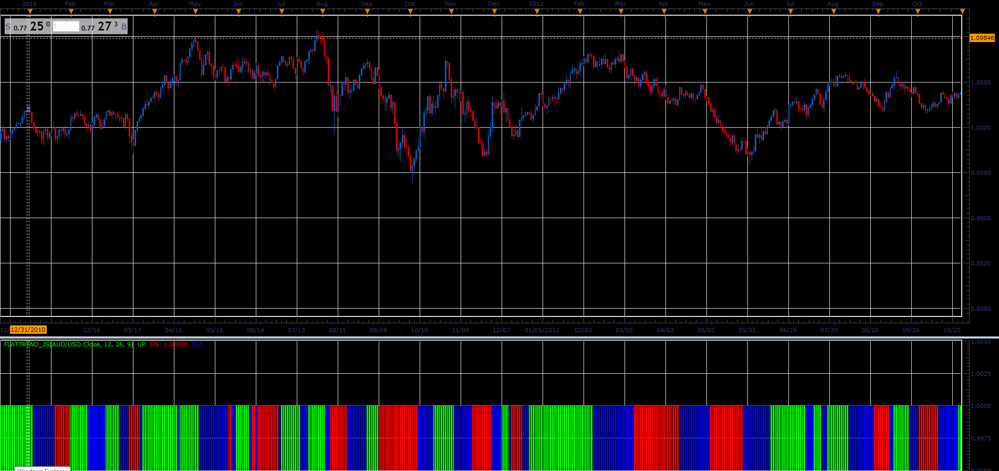

# Flat/Trend MACD indicator

> Source: https://fxcodebase.com/code/viewtopic.php?f=48&t=65998  
> Forum: 48 · Topic 65998 · 1 post(s)

---

## Flat/Trend MACD indicator

**Alexander.Gettinger** · Tue May 01, 2018 11:19 am

The indicator formula is
if SignalMACD<MACD and MACD>0 then indicator show up trend,
if SignalMACD>MACD and MACD<0 then indicator show down trend
else indicator show flat.

 

Download:

 [FlatTrend_JS.jsl](files/118924/FlatTrend_JS.jsl)
