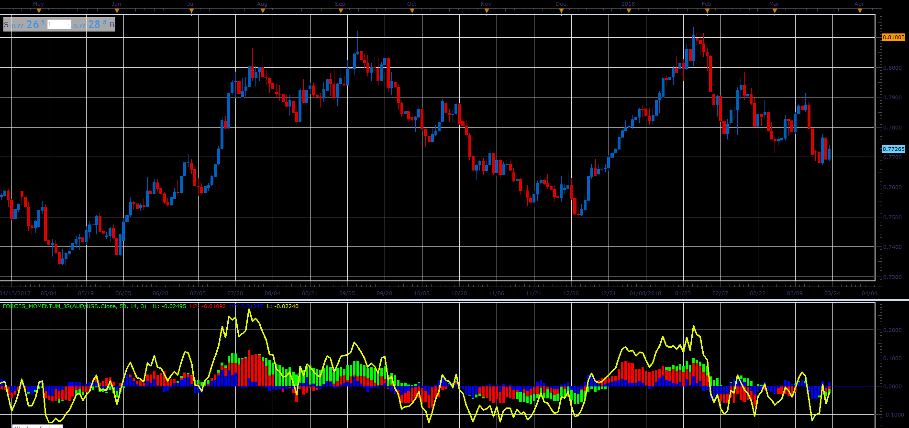

# Forces momentum oscillator

> Source: https://fxcodebase.com/code/viewtopic.php?f=48&t=66001  
> Forum: 48 · Topic 66001 · 1 post(s)

---

## Forces momentum oscillator

**Alexander.Gettinger** · Tue May 01, 2018 11:22 am

Formulas:
Line = Histogram1+Histogram2+Histogram3,
Histogram1[i] = (SMMA[i, Period1]-SMMA[i-1, Period1])*3*Period1,
Histogram2[i] = (MVA[i, Period2]-MVA[i-1, Period2])*3*Period2,
Histogram3[i] = (MVA[i, Period3]-MVA[i-1, Period3])*3*Period3.

 

Download:

 [Forces_Momentum_JS.jsl](files/118927/Forces_Momentum_JS.jsl)
