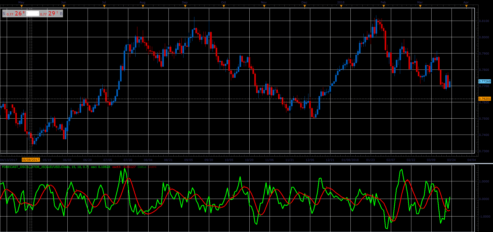

# Forecast Oscillator

> Source: https://fxcodebase.com/code/viewtopic.php?f=48&t=66002  
> Forum: 48 · Topic 66002 · 1 post(s)

---

## Forecast Oscillator

**Alexander.Gettinger** · Tue May 01, 2018 11:24 am

Original LUA indicator: [viewtopic.php?f=17&t=7637&p=111561](https://fxcodebase.com/code/viewtopic.php?f=17&t=7637&p=111561)

 

Download:

 [Forecast_Oscillator_JS.jsl](files/118928/Forecast_Oscillator_JS.jsl)
