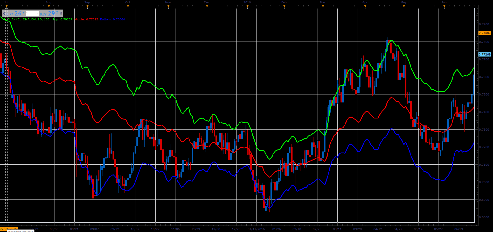

# FP channel

> Source: https://fxcodebase.com/code/viewtopic.php?f=48&t=66003  
> Forum: 48 · Topic 66003 · 1 post(s)

---

## FP channel

**Alexander.Gettinger** · Tue May 01, 2018 11:26 am

Formulas:
Middle line=sum/3,
Top line=(sum-min)/2,
Bottom line=(sum-max)/2, where
sum=max+min+pivot,
max(i), min(i) - maximum and minimum prices at range from (i-Period) to (i),
pivot(i)=(Close(i-1)+Close(i-2)+Close(i-3))/3.

 

Download:

 [FP_Channel_JS.jsl](files/118929/FP_Channel_JS.jsl)
