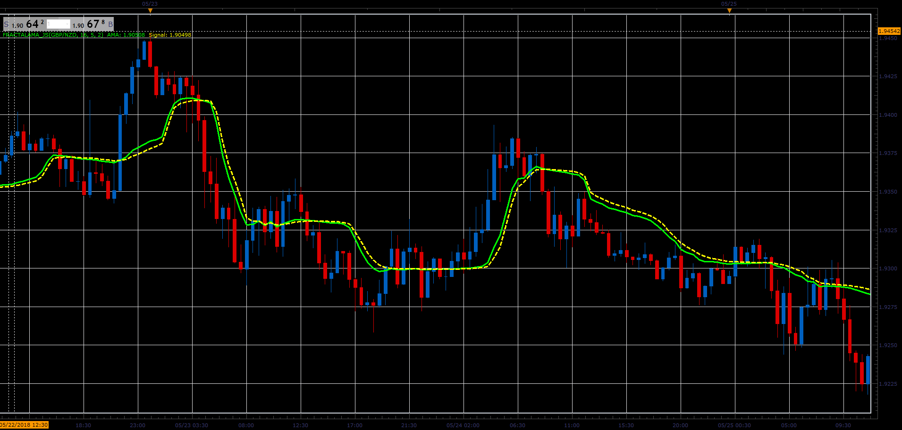

# Fractal AMA indicator

> Source: https://fxcodebase.com/code/viewtopic.php?f=48&t=66544  
> Forum: 48 · Topic 66544 · 1 post(s)

---

## Fractal AMA indicator

**Alexander.Gettinger** · Sat Aug 18, 2018 9:18 pm

Formulas:
AMA[i]=Alpha*Close[i]+(1-Alpha)*AMA[i-1],
Signal[i]=AlphaS*AMA[i]+(1-AlphaS)*Signal[i-1], where
Aplha=Exp(-Multiplier*(DE-1)),
AlphaS=Exp(-SMultiplier*(DE-1)),
DE=(ln(R1+R2)-ln(R3))/ln(2),
R1 - price range from (i-Period/2) to i,
R2 - price range from (i-i-Period) to (i-Period/2),
R3 - price range from (i-Period) to i.

 

Download:

 [FractalAMA_JS.jsl](files/120647/FractalAMA_JS.jsl)
