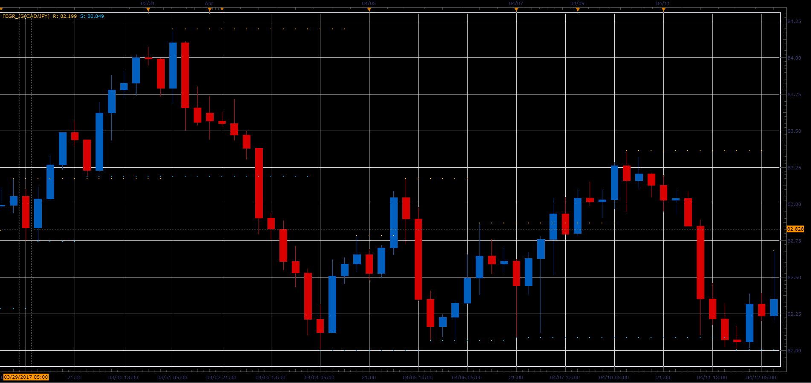

# Fractal Based Support/Resistance lines

> Source: https://fxcodebase.com/code/viewtopic.php?f=48&t=64793  
> Forum: 48 · Topic 64793 · 1 post(s)

---

## Fractal Based Support/Resistance lines

**Alexander.Gettinger** · Wed Jun 14, 2017 10:55 am

The simple indicator which starts a new support/resistance line every time when up or down fractal appears.

 

Download:

 [FBSR_JS.jsl](files/112886/FBSR_JS.jsl)
