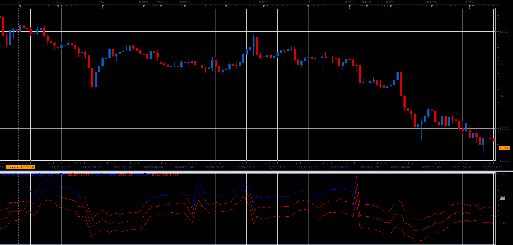

# Fractal Graph Dimension Indicator (FGDI)

> Source: https://fxcodebase.com/code/viewtopic.php?f=48&t=64795  
> Forum: 48 · Topic 64795 · 1 post(s)

---

## Fractal Graph Dimension Indicator (FGDI)

**Alexander.Gettinger** · Wed Jun 14, 2017 11:06 am

The indicator do not shows trend direction, but it shows the market is in trend or in volatility.

The indicator is described in Technical Analysis of Stocks and Commodities, in a article by Radha Panini, in March, 2007, which is based on Carlos Sevcik, "A procedure to Estimate the Fractal Dimension of Waveforms" article.

 

Download:

 [FGDI_JS.jsl](files/112888/FGDI_JS.jsl)
