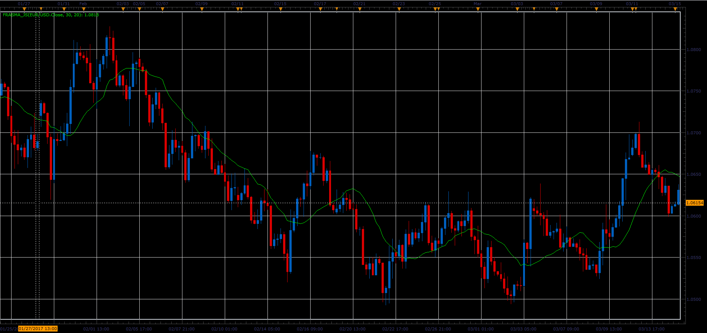

# FRASMA indicator

> Source: https://fxcodebase.com/code/viewtopic.php?f=48&t=64720  
> Forum: 48 · Topic 64720 · 1 post(s)

---

## FRASMA indicator

**Alexander.Gettinger** · Fri Jun 02, 2017 2:00 pm

Fractally Modified Simple Moving Average.

The SMA is accelerated during a trend and slowed down during a sideways market, so as to avoid false signals.

 

Download:

 [Frasma_JS.jsl](files/112709/Frasma_JS.jsl)
