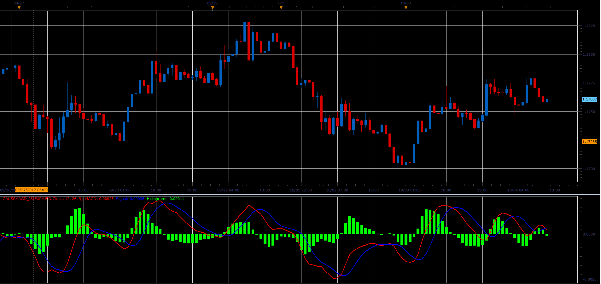

# Gaussian MACD

> Source: https://fxcodebase.com/code/viewtopic.php?f=48&t=65214  
> Forum: 48 · Topic 65214 · 1 post(s)

---

## Gaussian MACD

**Alexander.Gettinger** · Sat Oct 28, 2017 8:51 am

MACD with Gaussian MA instead of EMA.

 

Download:

 [GaussMACD_JS.jsl](files/115638/GaussMACD_JS.jsl)
