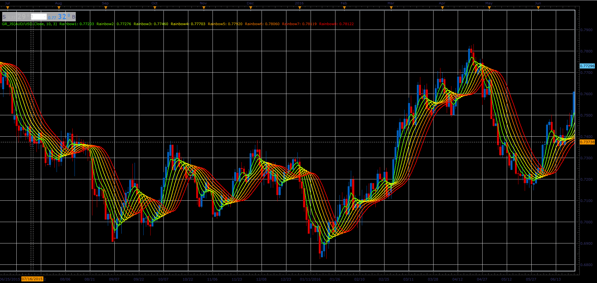

# Gaussian Rainbow

> Source: https://fxcodebase.com/code/viewtopic.php?f=48&t=66013  
> Forum: 48 · Topic 66013 · 1 post(s)

---

## Gaussian Rainbow

**Alexander.Gettinger** · Tue May 01, 2018 11:40 am

This indiactor uses gaussian filtration to get the first filter line,
the additional lines are calculated by refiltration of the last filter line.
Use it for spotting trends, sideway markets and retracement zones.

 

Download:

 [GR_JS.jsl](files/118939/GR_JS.jsl)
