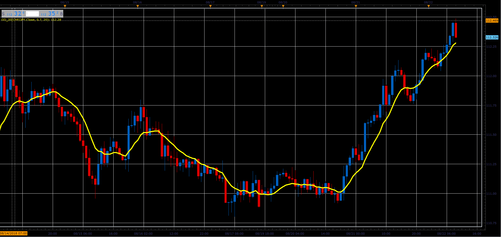

# Generalized DEMA

> Source: https://fxcodebase.com/code/viewtopic.php?f=48&t=66971  
> Forum: 48 · Topic 66971 · 1 post(s)

---

## Generalized DEMA

**Alexander.Gettinger** · Sat Nov 24, 2018 12:37 pm

Formula:
GD = (1+VF)*EMA1-VF*EMA2, where
EMA2 - EMA(EMA1) with [Length] number of periods,
EMA1 - EMA(Price) with [Length] number of periods.

 

Download:

 [GD_JS.jsl](files/122299/GD_JS.jsl)
