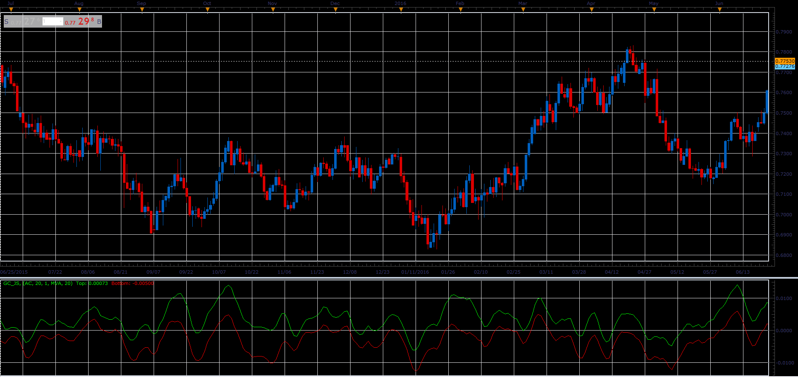

# Generic Channel

> Source: https://fxcodebase.com/code/viewtopic.php?f=48&t=66007  
> Forum: 48 · Topic 66007 · 1 post(s)

---

## Generic Channel

**Alexander.Gettinger** · Tue May 01, 2018 11:30 am

This indicator allows you to add a channel, to any indicator.
Use the standard deviation as a measure of volatility.
The initial smoothing is supported.

 

Download:

 [GC_JS.jsl](files/118933/GC_JS.jsl)
