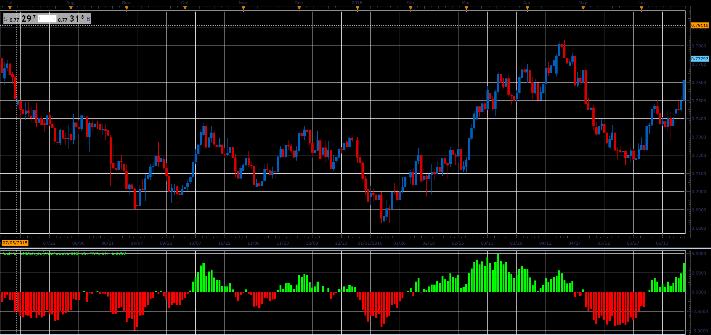

# Glitch Index

> Source: https://fxcodebase.com/code/viewtopic.php?f=48&t=66009  
> Forum: 48 · Topic 66009 · 1 post(s)

---

## Glitch Index

**Alexander.Gettinger** · Tue May 01, 2018 11:33 am

Formulas:
Glitch Index[i] = 100*diff[i]/Price[i], where
diff[i] = Price[i] - smamult[i],
smamult[i] = MA(i)*((MA(i)-MA(i-ROC_Length))*0.1+1),
MA - moving average with [MA_Length] and [MA_Method].

 

Download:

 [Glitch Index_JS.jsl](files/118935/Glitch%20Index_JS.jsl)
