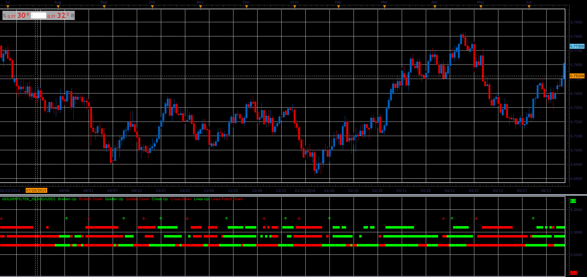

# Golden Filter

> Source: https://fxcodebase.com/code/viewtopic.php?f=48&t=66012  
> Forum: 48 · Topic 66012 · 1 post(s)

---

## Golden Filter

**Alexander.Gettinger** · Tue May 01, 2018 11:39 am

Line 1
Long
ShortMA / LongMA CrossOver
Short
ShortMA / LongMA CrossUnder

Line 2
Long
MACD > SIGNAL
DIP > DIM
RSI > 50
Short
MACD < SIGNAL
DIP < DIM
RSI < 50

Line 3
Long
Force Index > 0
DeMarker > 0.5
Short
Force Index < 0
DeMarker < 0.5

Line 4
Long
Momentum > 100
Short
Momentum < 100

 

Download:

 [GoldenFilter_JS.jsl](files/118938/GoldenFilter_JS.jsl)

Install both DeMarker Oscillator & Force Index Indicators
DeMarker Oscillator (DEM)
[viewtopic.php?f=17&t=22&p=5795](https://fxcodebase.com/code/viewtopic.php?f=17&t=22&p=5795)
Force Index (AEFI)
[viewtopic.php?f=17&t=1966&p=36260](https://fxcodebase.com/code/viewtopic.php?f=17&t=1966&p=36260)
