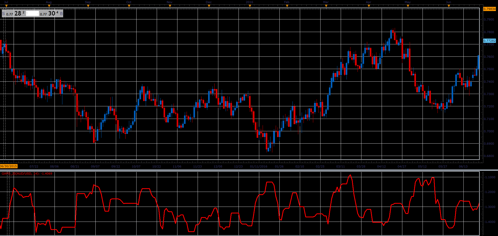

# Gopalakrishnan Range Index

> Source: https://fxcodebase.com/code/viewtopic.php?f=48&t=66006  
> Forum: 48 · Topic 66006 · 1 post(s)

---

## Gopalakrishnan Range Index

**Alexander.Gettinger** · Tue May 01, 2018 11:29 am

Formulas:
GAPO[i] = Log(Max-Min)/Log(Length), where
Log - logarithm,
Max, Min - maximum and minimum prices at the range from (i-Length+1) to (i).

 

Download:

 [GAPO_JS.jsl](files/118932/GAPO_JS.jsl)
