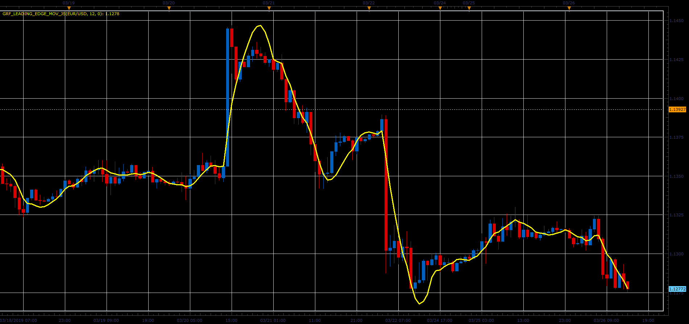

# GRF Leading Edge moving average

> Source: https://fxcodebase.com/code/viewtopic.php?f=48&t=68264  
> Forum: 48 · Topic 68264 · 1 post(s)

---

## GRF Leading Edge moving average

**Alexander.Gettinger** · Sat Mar 30, 2019 3:34 pm

The indicator was developed to solve the lag problem that is so often inherent in averaging trading methods.

 

Download:

 [GRF_Leading_Edge_Mov_JS.jsl](files/125484/GRF_Leading_Edge_Mov_JS.jsl)
