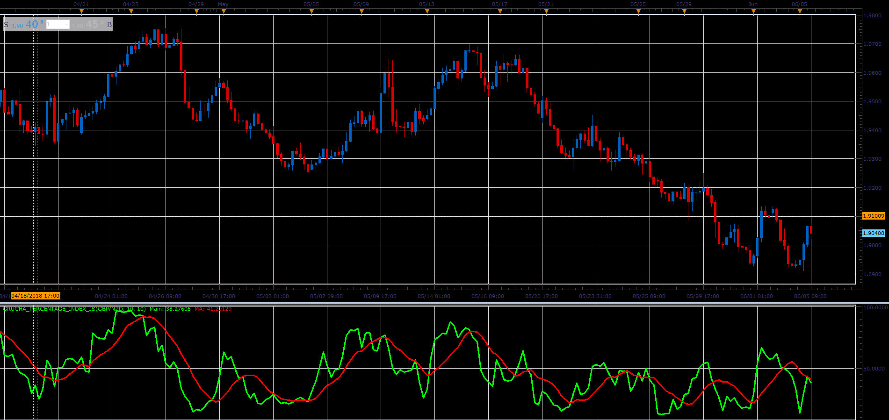

# GRUCHA Percentage Index

> Source: https://fxcodebase.com/code/viewtopic.php?f=48&t=66434  
> Forum: 48 · Topic 66434 · 4 post(s)

---

## GRUCHA Percentage Index

**Alexander.Gettinger** · Mon Aug 06, 2018 1:54 pm

Formulas:
Stream1=MVA(2*a1-HHV),
Stream2=MVA(2*a1-LLV),
Stream3=MVA((HHV2+LLV2+Price)/3),
Stream4=(Stream1+Stream2+Stream3)/3, where
a1=(HHV+LLV+Price)/3,
HHV[i] - maximum price from i-Period to i,
LLV[i] - minimum price from i-Period to i,
HHV2 - maximum price from i-Period/2 to i,
LLV2 - minimum price from i-Period/2 to i.

 

Download:

 [Grucha_Percentage_Index_JS.jsl](files/120366/Grucha_Percentage_Index_JS.jsl)

---

## Re: GRUCHA Percentage Index

**xristos1982** · Wed Mar 08, 2023 4:01 pm

Can i have this in Lua,please?

---

## Re: GRUCHA Percentage Index

**Apprentice** · Sat Mar 11, 2023 4:04 am

We have added your request to the development list.
Development reference 228.

---

## Re: GRUCHA Percentage Index

**Apprentice** · Wed Mar 15, 2023 4:16 pm

Try this version.
[https://fxcodebase.com/code/viewtopic.php?f=17&t=73489](https://fxcodebase.com/code/viewtopic.php?f=17&t=73489)

It is important to note that you can use JS versions the same way you would use lua versions.
