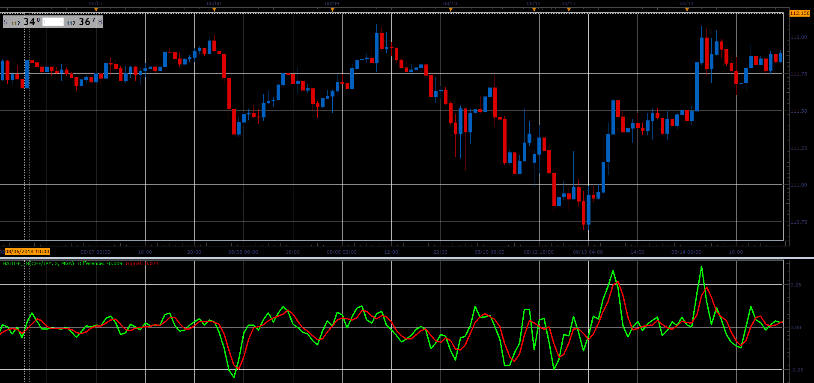

# HA Difference

> Source: https://fxcodebase.com/code/viewtopic.php?f=48&t=66973  
> Forum: 48 · Topic 66973 · 1 post(s)

---

## HA Difference

**Alexander.Gettinger** · Sat Nov 24, 2018 1:05 pm

Formulas:
haOpen[i] = (haOpen[i-1]+haClose[i-1])/2,
haClose[i] = (Open[i]+High[i]+Low[i]+Close[i])/4,
haDiff[i] = haClose-haOpen,
Signal = MA(haDiff),
MA - moving average with [Method] as type and [Length] as number of periods.

 

Download:

 [haDiff_JS.jsl](files/122302/haDiff_JS.jsl)
