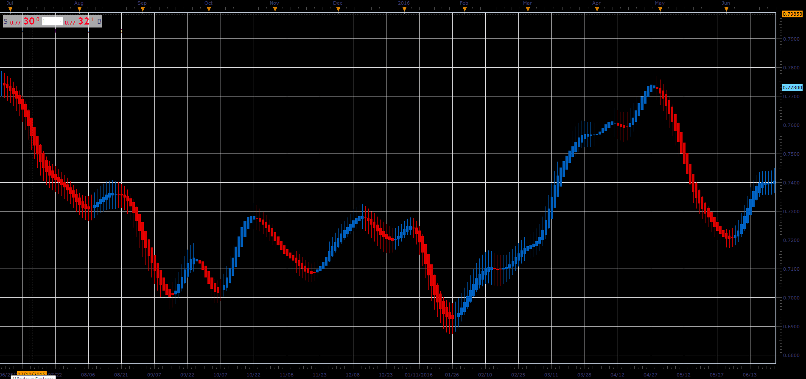

# Heikin-Ashi Smoothed

> Source: https://fxcodebase.com/code/viewtopic.php?f=48&t=66014  
> Forum: 48 · Topic 66014 · 1 post(s)

---

## Heikin-Ashi Smoothed

**Alexander.Gettinger** · Tue May 01, 2018 11:41 am

The Heikin-Ashi smoothed indicator is similar to the regular Heikin-Ashi, but:

a) uses the smoothed open, close, high and low prices
b) smooths the candles

So, formula of the indicator is:

open = MVA(MVA(OPEN, N1)[-1] + MVA(CLOSE, N1) / 2, N2)
close = MVA(MVA(OPEN, N1) + MVA(CLOSE, N1) + MVA(HIGH, N1) + MVA(LOW, N1)/ 2, N2)
high = MAX(open, close, MVA(HIGH, N1), N2)
low = MIN(open, close, MVA(LOW, N1), N2)

By default, the indicator hides the source data and is shown instead of the source.
To show the both, source data and Heikin-Ashi chart:

1) Uncheck "Hide Source" on the "Data Source" tab of the indicator properties.
2) Check "Show indicator/oscillator in an new area..." on the "Location" tab of the indicator properties.

As the standard HA indicator, the HASM indicator result is a regular bar source, so you can apply any existing indicator on it.

 

Download:

 [HASM_JS.jsl](files/118940/HASM_JS.jsl)
