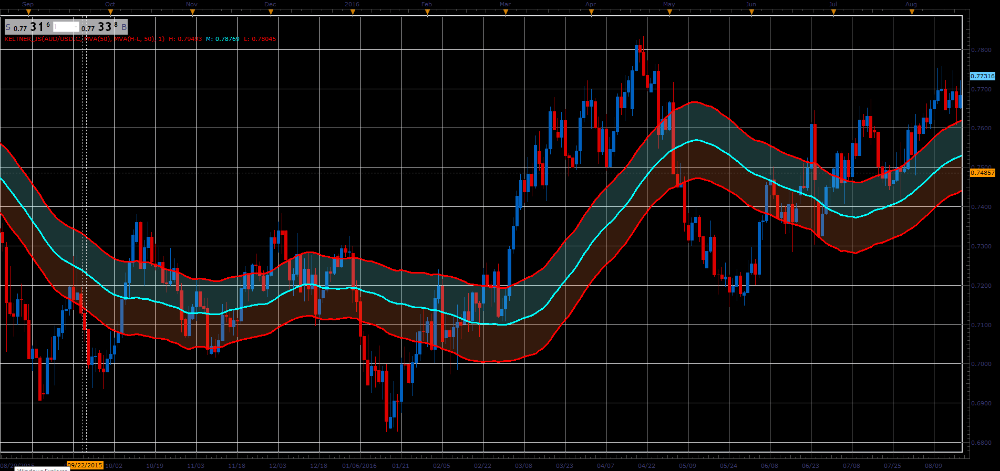

# High Customizable Keltner

> Source: https://fxcodebase.com/code/viewtopic.php?f=48&t=66043  
> Forum: 48 · Topic 66043 · 1 post(s)

---

## High Customizable Keltner

**Alexander.Gettinger** · Wed May 02, 2018 11:39 am

Keltner indicator looks similar and is calculated similar to the Bollinger Band Indicator.

In common, formula is:

Keltner.High(i) = Smooth(Source) + Variation * Factor
Keltner.Low(i) = Smooth(Source) - Variation * Factor

There are many choices how to smooth the source and what is the variation.

The most common cases are:
Case 1). Smoothing is Moving Average, Source is Close, Variation is average of the differences between high and low:
Keltner.High = Avg(Close) + Avg(High - Low)
Keltner.Low = Avg(Close) - Avg(High - Low)

Case 2). Smoothing is Moving Average, the Source is Median and Variation is Average True Range
Keltner.High = Avg((High + Low + Close)/3) + ATR(Bar)
Keltner.Low = Avg((High + Low + Close)/3) - ATR(Bar)

The implementation here lets you customize the source, smoothing method and variation method.
Source can be:
a) Close Price
b) Median as (High + Low) / 2
c) Median as (High + Low + Close) / 3

Smoothing could be:
a) Simple Moving Average (MVA)
b) Exponential Moving Average (EMA)
c) Linear Weighted Moving Average (LWMA)
d) Smoothed Moving Average (SMMA)
e) Wilder's Moving Average (WMA)

 

Download:

 [Keltner_JS.jsl](files/118994/Keltner_JS.jsl)
