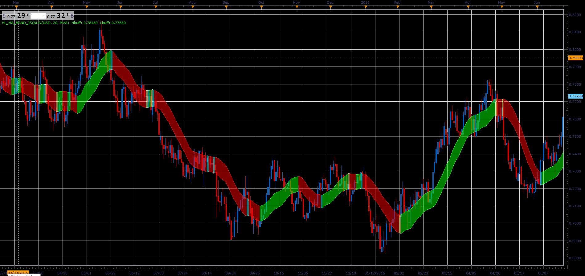

# High/Low MA band

> Source: https://fxcodebase.com/code/viewtopic.php?f=48&t=66015  
> Forum: 48 · Topic 66015 · 1 post(s)

---

## High/Low MA band

**Alexander.Gettinger** · Tue May 01, 2018 11:43 am

The indicator draws the band bounded by two moving averages (for High and Low prices).

 

Download:

 [HL_MA_Band_JS.jsl](files/118941/HL_MA_Band_JS.jsl)

For this indicator must be installed Averages indicator ([viewtopic.php?f=17&t=2430](https://fxcodebase.com/code/viewtopic.php?f=17&t=2430)).
