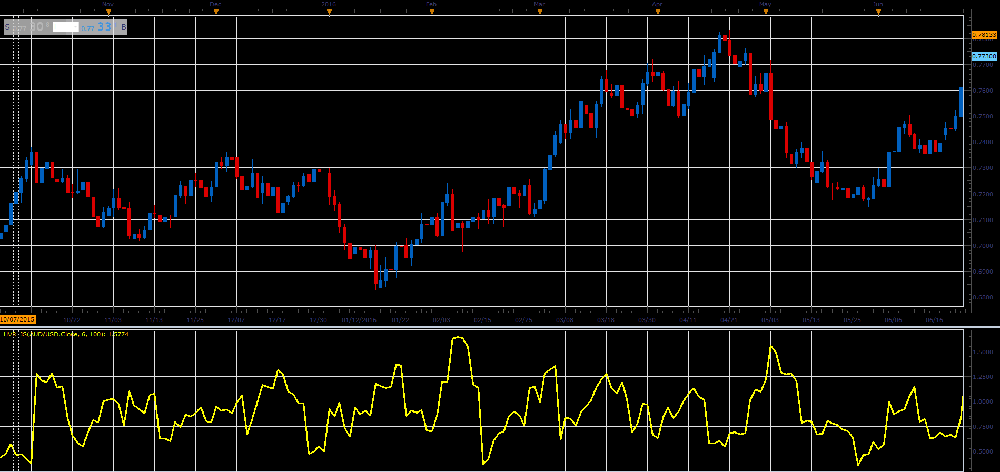

# Historical Volatility Ratio oscillator

> Source: https://fxcodebase.com/code/viewtopic.php?f=48&t=66035  
> Forum: 48 · Topic 66035 · 1 post(s)

---

## Historical Volatility Ratio oscillator

**Alexander.Gettinger** · Wed May 02, 2018 11:26 am

Formulas:
HVR = StdDev1/StdDev2, where
StdDev1 - standard deviation with Period1,
StdDev2 - standard deviation with Period2.

 

Download:

 [HVR_JS.jsl](files/118986/HVR_JS.jsl)
