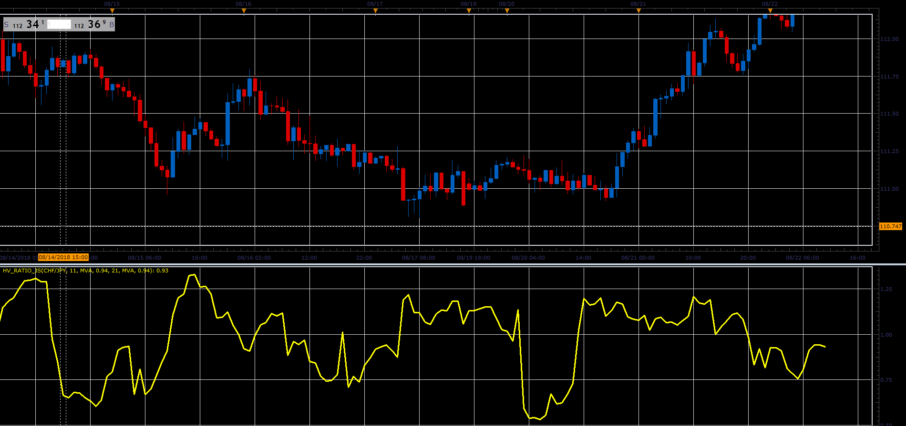

# Historical Volatility ratio

> Source: https://fxcodebase.com/code/viewtopic.php?f=48&t=66974  
> Forum: 48 · Topic 66974 · 1 post(s)

---

## Historical Volatility ratio

**Alexander.Gettinger** · Sat Nov 24, 2018 1:09 pm

Formula:
HV_Ratio=HV(Period1, Method1, decline1)/HV(Period2, Method2, decline2).

 

Download:

 [HV_Ratio_JS.jsl](files/122303/HV_Ratio_JS.jsl)
