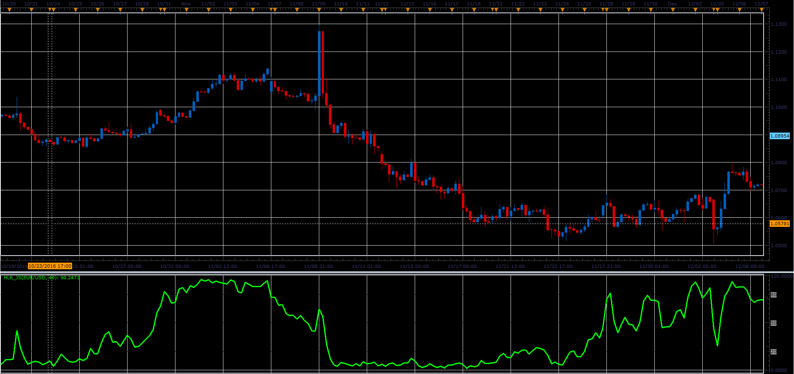

# HLR oscillator

> Source: https://fxcodebase.com/code/viewtopic.php?f=48&t=64722  
> Forum: 48 · Topic 64722 · 1 post(s)

---

## HLR oscillator

**Alexander.Gettinger** · Fri Jun 02, 2017 2:03 pm

Formula:
HLR[i]=100*(MidPrice-Min)/(Max-Min), where
MidPrice - median price,
Max and Min - maximum and minimum prices at range from (i-Period) to (i).

 

Download:

 [HLR_JS.jsl](files/112711/HLR_JS.jsl)
