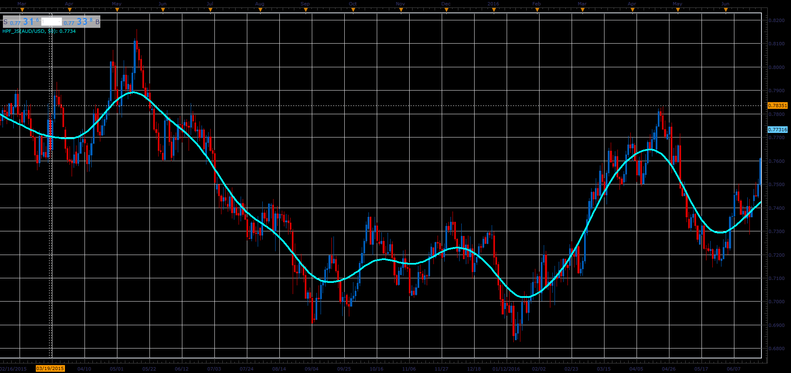

# Hodrick-Prescott Filter

> Source: https://fxcodebase.com/code/viewtopic.php?f=48&t=66016  
> Forum: 48 · Topic 66016 · 1 post(s)

---

## Hodrick-Prescott Filter

**Alexander.Gettinger** · Tue May 01, 2018 11:44 am

The Hodrick-Prescott filter is a mathematical tool used in macroeconomics, especially in real business cycle theory to separate the cyclical component of a time series from raw data.

It is used to obtain a smoothed non-linear representation of a time series, it is more sensitive to long-term than to short-term fluctuations.

 

Download:

 [HPF_JS.jsl](files/118942/HPF_JS.jsl)
