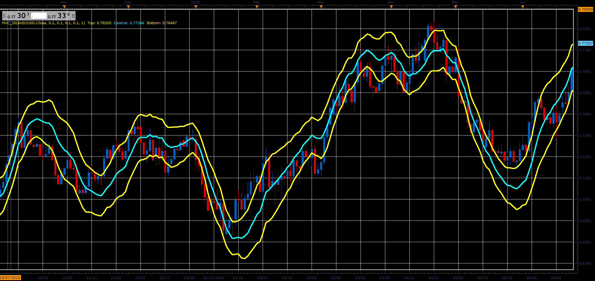

# Holt-Winter Channel

> Source: https://fxcodebase.com/code/viewtopic.php?f=48&t=66033  
> Forum: 48 · Topic 66033 · 1 post(s)

---

## Holt-Winter Channel

**Alexander.Gettinger** · Wed May 02, 2018 11:24 am

Formulas:
Top = HWMA+Multiplier*StDt,
Bottom = HWMA-Multiplier*StDt, where
HWMA - Holt-Winter Moving Average,
StDt[i] = Sqrt(Var[i-1]),
Var[i] = (1-d)*Var[i-1]+d*(Price[i-1]-HWMA[i-1])*(Price[i-1]-HWMA[i-1]).

 

Download:

 [HVC_JS.jsl](files/118984/HVC_JS.jsl)
