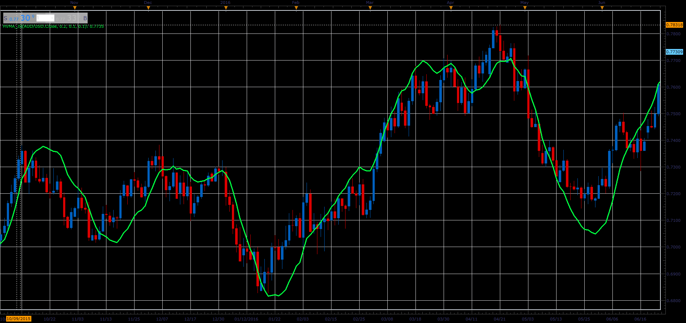

# Holt-Winter Moving Average

> Source: https://fxcodebase.com/code/viewtopic.php?f=48&t=66034  
> Forum: 48 · Topic 66034 · 1 post(s)

---

## Holt-Winter Moving Average

**Alexander.Gettinger** · Wed May 02, 2018 11:25 am

Formulas:
HWMA[i] = F[i]+V[i]+0.5*A[i], where
F[i] = (1-a)*(F[i-1]+V[i-1]+0.5*A[i-1])+a*Price[i],
V[i] = (1-b)*(V[i-1]+A[i-1])+b*(F[i]-F[i-1]),
A[i] = (1-c)*A[i-1]+c*(V[i]-V[i-1]).

 

Download:

 [HVMA_JS.jsl](files/118985/HVMA_JS.jsl)
