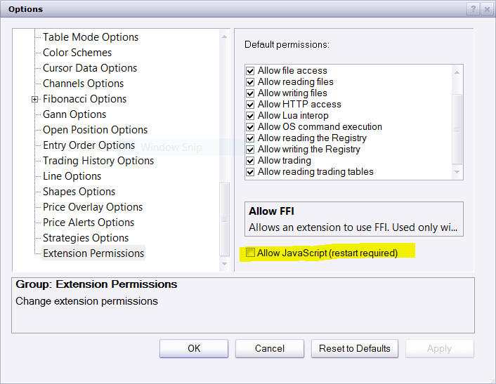

# How to upload / allowed indicators with .jsl extension

> Source: https://fxcodebase.com/code/viewtopic.php?f=48&t=64425  
> Forum: 48 · Topic 64425 · 1 post(s)

---

## How to upload / allowed indicators with .jsl extension

**Apprentice** · Sun Mar 12, 2017 4:46 pm

Make sure to allow javascript, enabled "Allow JavaScript" checkbox in options (Extension Permissions) TS restart is required.
