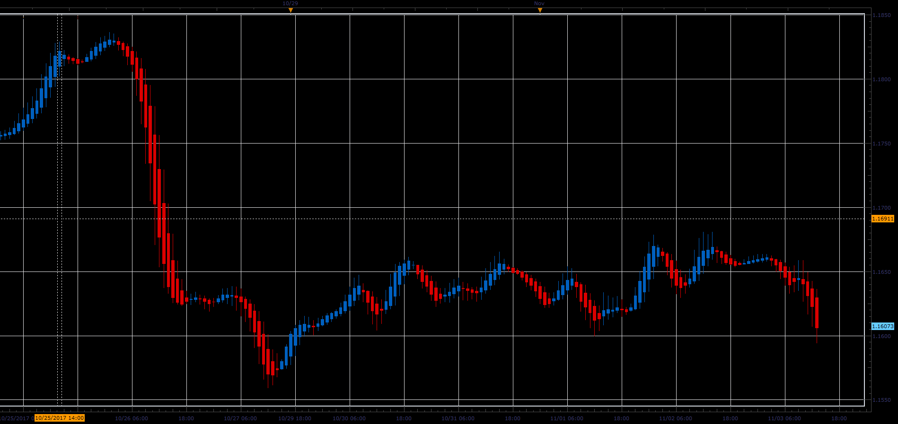

# Hull candles

> Source: https://fxcodebase.com/code/viewtopic.php?f=48&t=65549  
> Forum: 48 · Topic 65549 · 1 post(s)

---

## Hull candles

**Alexander.Gettinger** · Sat Jan 06, 2018 2:52 pm

Formulas:
High[i] = Max(X_H, Open[i-1], Close[i-1]),
Low[i] = Min(X_L, Open[i-1], Close[i-1]),
Open[i] = (Open[i-1]+Close[i-1])/2,
Close[i] = (X_O+X_H+X_L+X_C)/4, where
X_O = 2*MA(Open, Period/2)-MA(Open, Period),
X_H = 2*MA(High, Period/2)-MA(High, Period),
X_L = 2*MA(Low, Period/2)-MA(Low, Period),
X_C = 2*MA(Close, Period/2)-MA(Close, Period).

 

Download:

 [Hull_Candles_JS.jsl](files/116828/Hull_Candles_JS.jsl)

For this indicator must be installed Averages indicator ([viewtopic.php?f=17&t=2430](https://fxcodebase.com/code/viewtopic.php?f=17&t=2430)).
