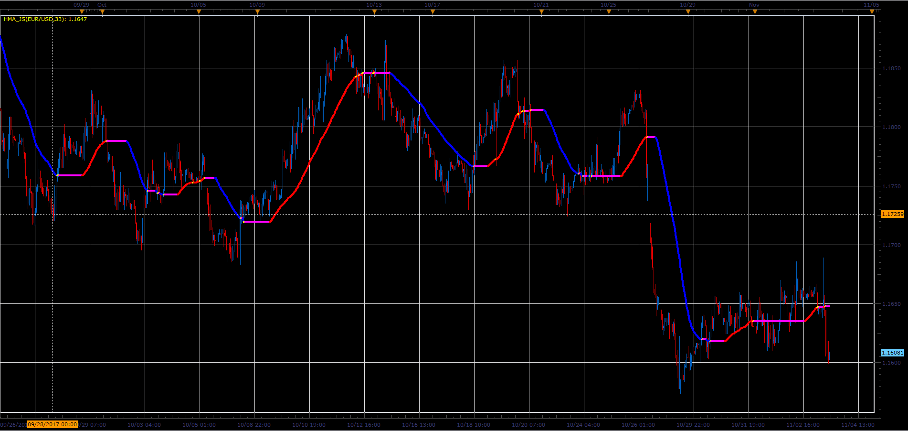

# Hull Moving Average (HMA)

> Source: https://fxcodebase.com/code/viewtopic.php?f=48&t=65548  
> Forum: 48 · Topic 65548 · 1 post(s)

---

## Hull Moving Average (HMA)

**Alexander.Gettinger** · Sat Jan 06, 2018 2:51 pm

The Hull Moving Average (HMA) developed by Alan Hull, is an extremely fast and smooth moving average.

HMA trying to eliminates lag time and keep smoothing at the same time.

HMA=LWMA ([2 x LWMA (Price, Period/2) - LWMA (Price, Period)], SQRT (Period)).

 

Download:

 [HMA_JS.jsl](files/116827/HMA_JS.jsl)
