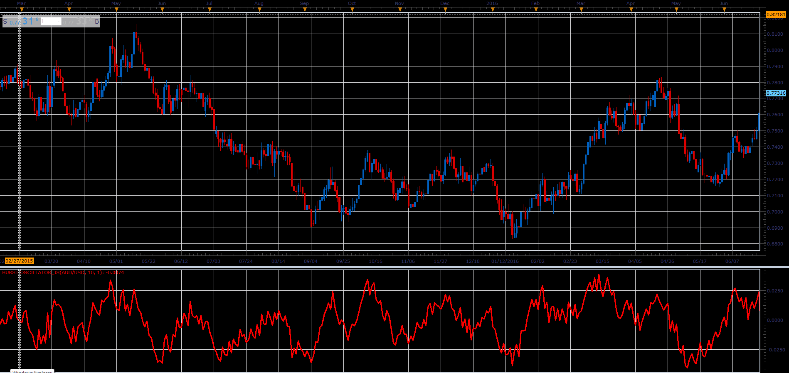
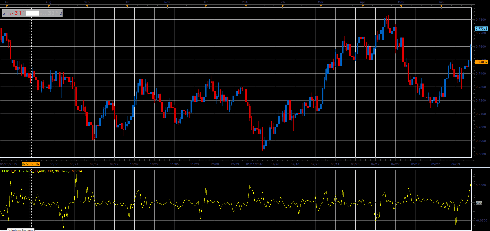

# Hurst oscillator

> Source: https://fxcodebase.com/code/viewtopic.php?f=48&t=66032  
> Forum: 48 · Topic 66032 · 2 post(s)

---

## Hurst oscillator

**Alexander.Gettinger** · Wed May 02, 2018 11:21 am

Formula:
HO[i] = MA[i]-CMA[i-Length/2-1], where
CMA = MVA(Median price) with [Length] number of periods,
MA = MVA(FlowValue) with [Smooth] number of periods,
FlowValue[i] = High[i], if Close[i]>Close[i-1],
FlowValue[i] = Low[i], if Close[i]<Close[i-1],
FlowValue[i] = (High[i]+Low[i])/2, if Close[i]=Close[i-1].

 

Download:

 [Hurst Oscillator_JS.jsl](files/118982/Hurst%20Oscillator_JS.jsl)

---

## Re: Hurst oscillator

**Alexander.Gettinger** · Wed May 02, 2018 11:23 am

**Hurst difference:**

 

Download:

 [Hurst_Difference_JS.jsl](files/118983/Hurst_Difference_JS.jsl)
