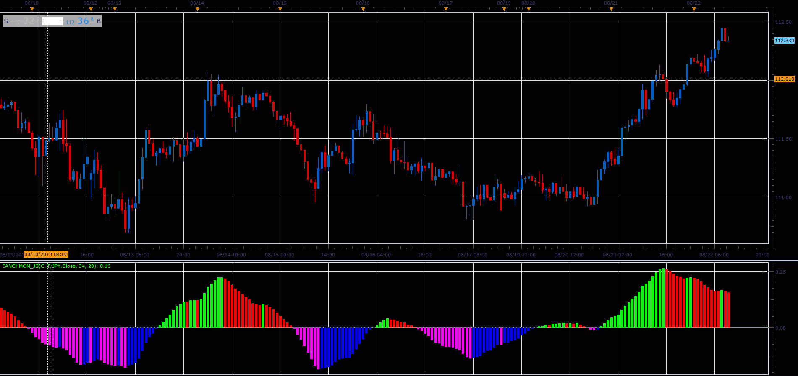

# iAnchMom oscillator

> Source: https://fxcodebase.com/code/viewtopic.php?f=48&t=66975  
> Forum: 48 · Topic 66975 · 1 post(s)

---

## iAnchMom oscillator

**Alexander.Gettinger** · Sat Nov 24, 2018 1:14 pm

Formula:
iAnchMom = 100*(EMA(Price) - MVA(Price)-1).

 

Download:

 [iAnchMom_JS.jsl](files/122304/iAnchMom_JS.jsl)
